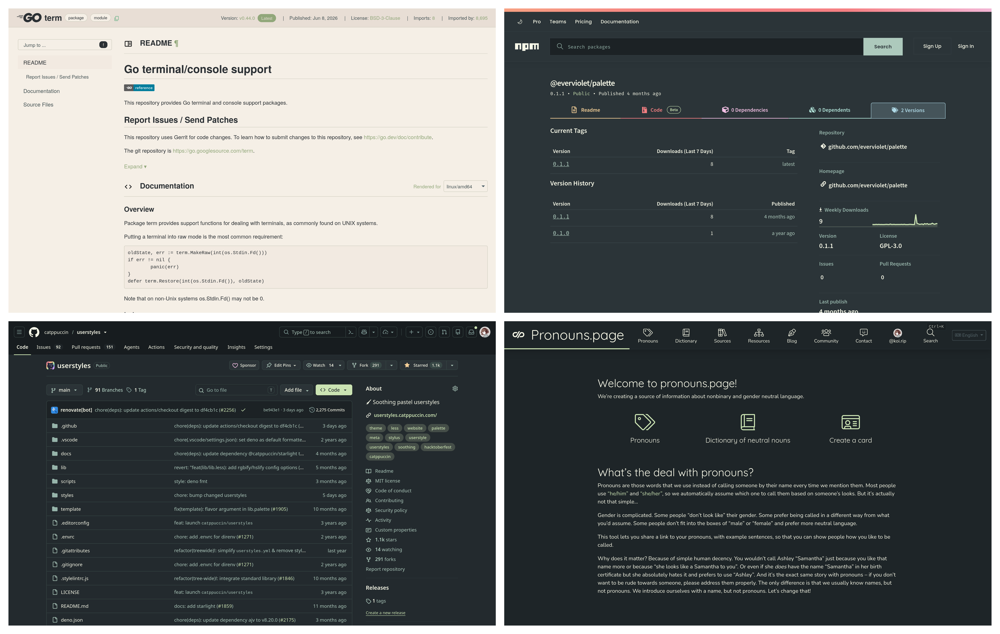

<h3 align="center">
  <br/>
  Evergarden for <a href="https://userstyles.catppuccin.com">Userstyles</a>
</h3>

<p align="center">
  <a href="https://codeberg.org/evergarden/userstyles/stars">
    
  </a>
  <a href="https://codeberg.org/evergarden/userstyles/issues">
    
  </a>
  <a href="https://codeberg.org/evergarden/userstyles/activity/contributors">
    
  </a>
</p>

<p align="center">
  
</p>

### Usage

1. Install [Stylus](https://github.com/openstyles/stylus)
2. Download the compiled import file with all userstyles included
   ([`import.json`](https://evergarden.moe/userstyles/import.json))
3. Open the **Stylus manager** page
4. Click **Import** on the sidebar panel, and select the downloaded file

### Configuration

By default, all userstyles have the dark variant set to fall, light variant to summer, and accent
color to green.

This can be configured manually for individual userstyles through the Stylus UI or by modifying
the import file, like so:

```bash
# set the default accent color to pink
sed -iE 's/"default":"green"/"default":"pink"/g' import.json

# set the default dark variant to fall
sed -iE 's/"default":"winter"/"default":"fall"/g' import.json

# set the default light variant to spring
sed -iE 's/"default":"summer"/"default":"spring"/g' import.json
```

For more information, see [userstyles.catppuccin.com](https://userstyles.catppuccin.com) :3

### Thanks to <3

- [catppuccin](https://github.com/catppuccin/userstyles)
- [robin](https://codeberg.org/comfysage)
- [june](https://codeberg.org/koibtw)

<hr>

<p align="center">
  <a href="https://codeberg.org/evergarden/userstyles/src/LICENSE">
    
  </a>
</p>
